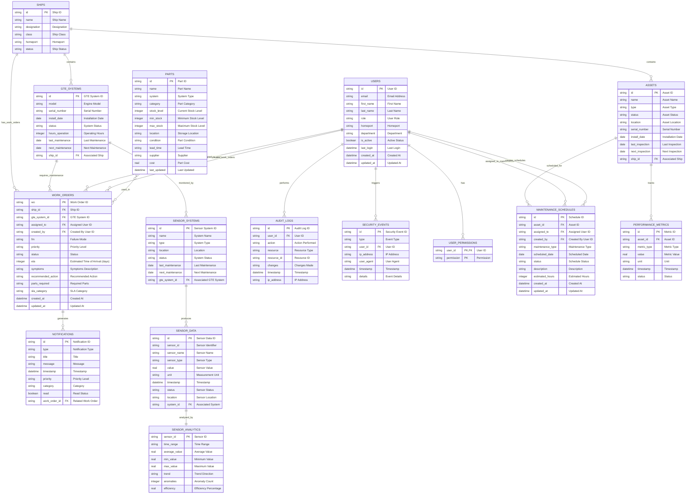

# Navy PdM System - Entity Relationship Diagram

## Entity Descriptions

### Core Entities

**WORK_ORDERS**: Central entity tracking maintenance work orders for gas turbine engines
- Primary key: `wo` (Work Order ID)
- Foreign keys: `ship_id`, `gte_system_id`, `assigned_to`, `created_by`
- Tracks failure mode, priority, status, and maintenance details
- Links to ships, GTE systems, users, parts, and notifications

**PARTS**: Inventory management for maintenance parts
- Primary key: `id` (Part ID)
- Tracks stock levels, suppliers, costs, and locations
- Categorized by system type and part category

**NOTIFICATIONS**: Alert system for critical events
- Primary key: `id` (Notification ID)
- Links to work orders for context
- Categorized by type, priority, and category

### Fleet Management

**SHIPS**: Naval vessel information
- Primary key: `id` (Ship ID)
- Contains multiple GTE systems and assets
- Tracks homeport and operational status

**GTE_SYSTEMS**: Gas Turbine Engine systems
- Primary key: `id` (GTE System ID)
- Belongs to ships
- Tracks maintenance schedules and operating hours

**ASSETS**: General asset management for ships
- Primary key: `id` (Asset ID)
- Belongs to ships
- Tracks asset status, inspections, and maintenance

### Sensor Monitoring

**SENSOR_SYSTEMS**: Groups of sensors monitoring GTE systems
- Primary key: `id` (Sensor System ID)
- Associated with GTE systems
- Tracks system status and maintenance

**SENSOR_DATA**: Real-time sensor readings
- Primary key: `id` (Sensor Data ID)
- Produced by sensor systems
- Contains timestamped measurements

**SENSOR_ANALYTICS**: Processed sensor data analysis
- Primary key: `sensor_id` (Sensor ID)
- One-to-one with sensor data
- Contains trend analysis and anomaly detection

### Maintenance Management

**MAINTENANCE_SCHEDULES**: Planned maintenance activities
- Primary key: `id` (Schedule ID)
- Foreign keys: `asset_id`, `assigned_to`, `created_by`
- Links to assets and assigned users
- Tracks scheduled maintenance tasks and assignments

**PERFORMANCE_METRICS**: Asset performance tracking
- Primary key: `id` (Metric ID)
- Links to assets
- Tracks various performance indicators

### Security & Audit

**USERS**: System users with role-based access
- Primary key: `id` (User ID)
- Has permissions and generates audit logs
- Tracks login history and activity

**AUDIT_LOGS**: System activity tracking
- Primary key: `id` (Audit Log ID)
- Links to users and resources
- Records all system changes

**SECURITY_EVENTS**: Security monitoring
- Primary key: `id` (Security Event ID)
- Links to users
- Tracks security-related events

**USER_PERMISSIONS**: Role-based access control
- Composite primary key: `user_id`, `permission`
- Many-to-many relationship between users and permissions

## Key Relationships

### Core Work Order Relationships
1. **Work Orders** generate **Notifications** for critical events
2. **Ships** have multiple **Work Orders** for maintenance needs
3. **GTE Systems** require **Work Orders** when maintenance is needed
4. **Users** are assigned to **Work Orders** and create them
5. **Parts** are used in **Work Orders** (many-to-many relationship)

### Fleet Management Relationships
6. **Ships** contain multiple **GTE Systems** and **Assets**
7. **GTE Systems** are monitored by **Sensor Systems**
8. **Sensor Systems** produce **Sensor Data**
9. **Sensor Data** is analyzed to create **Sensor Analytics**

### Maintenance Management Relationships
10. **Assets** have **Maintenance Schedules** and **Performance Metrics**
11. **Users** are assigned to **Maintenance Schedules** and create them
12. **Users** perform actions that generate **Audit Logs**

### User Management Relationships
13. **Users** have **Permissions** for system access
14. **Users** trigger **Security Events** through system interactions
15. **Users** are tracked through **Audit Logs** for all system activities

## Database Schema Notes

### Current Implementation
- **SQLite Database**: `navy_pdm.db` located in `backend/instance/`
- **Tables**: `work_orders`, `parts`, `notifications`
- **Server**: Node.js/Express with SQLite3
- **Frontend**: React with TypeScript

### TypeScript Types
The application defines comprehensive TypeScript interfaces in `app/types/index.ts`:
- `WorkOrder`, `Part`, `Notification`, `User`
- `Ship`, `GTESystem`, `Asset`
- `SensorData`, `SensorSystem`, `SensorAnalytics`
- `MaintenanceSchedule`, `PerformanceMetrics`
- `AuditLog`, `SecurityEvent`

### Sensor Data Types
Sensor-related types are imported from the types file:
- `SensorType`: "temperature" | "pressure" | "vibration" | "rpm" | "oil_level" | "fuel_flow" | "voltage" | "current"
- `SensorStatus`: "normal" | "warning" | "critical" | "maintenance" | "offline"
- `SystemStatus`: "operational" | "degraded" | "critical" | "offline"

### User Roles
- `admin`: Full system access
- `commander`: Command-level access
- `maintenance_manager`: Maintenance oversight
- `maintainer`: Field maintenance operations
- `pmo_officer`: Program management
- `viewer`: Read-only access

### Part Categories
- Hot Section
- Rotating Parts
- Consumables
- Electronics
- Hydraulics
- Fuel System

### Work Order Priorities
- Routine: Standard maintenance
- Urgent: Time-sensitive repairs
- CASREP: Casualty Report (critical)

### Work Order Status
- Submitted
- In Progress
- Completed
- Cancelled
- On Hold